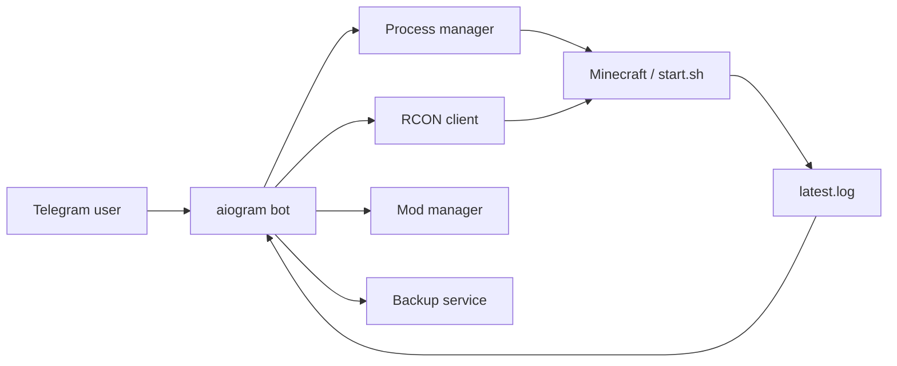

# 🎮 Telegram Minecraft Server Manager

Control a Linux Minecraft server from Telegram: start/stop/restart, RCON console, status, mods, backups and selected server events.

> Built with Python 3.11+ and aiogram 3.x. Minecraft itself does **not** need to be managed by systemd.

[Русская версия](README_RU.md)

## Why this project

This is a small self-hosted control panel for a private Minecraft server. The bot runs separately from Minecraft and starts the server process directly from a configured command.

That means you can use your existing launch script:

```env
SERVER_START_COMMAND=./start.sh
```

or launch Java directly:

```env
SERVER_START_COMMAND=java -Xms2G -Xmx6G -jar fabric-server-launch.jar nogui
```

No `sudo systemctl minecraft ...`, no broad sudoers rule, and no hard-coded JAR path in the bot.

## Features

| Feature | What it does |
| --- | --- |
| ▶️ Process control | Start, stop and restart Minecraft directly |
| 📊 Status | PID, uptime, process-tree RAM and online players |
| 💻 RCON console | Run Minecraft commands from an isolated Telegram console mode |
| 🧩 Mod manager | List, upload and delete `.jar` mods |
| 💾 Backups | Create RCON-coordinated ZIP backups with saves paused and flushed |
| 📜 Logs | Show launch output and forward selected player/chat/death events |
| 🔐 Access control | `OWNER_IDS` plus per-user roles and permissions from `users.json` |

## Architecture



The process manager stores PID + process creation time. This lets the bot reconnect to the same managed process after the bot itself restarts while reducing PID-reuse mistakes.

## Quick start

### 1. Clone and install

```bash
git clone https://github.com/sqwiziiy/Telegram-Minecraft-Server-Manager.git
cd Telegram-Minecraft-Server-Manager

python3 -m venv .venv
source .venv/bin/activate
pip install -r requirements.txt
```

### 2. Configure

```bash
cp .env.example .env
nano .env
```

Minimum useful configuration:

```env
BOT_TOKEN=123456:replace_me
OWNER_IDS=123456789

SERVER_DIR=/srv/minecraft
SERVER_START_COMMAND=./start.sh

RCON_HOST=127.0.0.1
RCON_PORT=25575
RCON_PASSWORD=replace_me
```

### Granular access for other users

Owners are configured in `.env` and always have full access:

```env
OWNER_IDS=123456789
```

For friends or other users, copy the example access policy:

```bash
cp users.example.json users.json
nano users.json
```

Example for a friend who may start, stop and restart the server and **only view mods**:

```json
{
  "users": {
    "987654321": {
      "name": "Friend",
      "role": "operator",
      "allow": [],
      "deny": []
    }
  }
}
```

The built-in `operator` role grants only:

- `server.status`
- `server.start`
- `server.stop`
- `server.restart`
- `mods.view`

It does not grant RCON console access, mod upload/delete, logs, host system information or backups. Unauthorized buttons are hidden, and every sensitive handler/callback also checks the permission server-side.

Use `role: "custom"` for an empty baseline, or adjust a preset with `allow` and `deny`. `deny` always wins.

Restart the bot after editing `users.json` so the policy is reloaded.

Your `start.sh` should keep Minecraft in the foreground. Do **not** end it with `&` or daemonize Java.

Example:

```bash
#!/usr/bin/env bash
exec java -Xms2G -Xmx6G -jar fabric-server-launch.jar nogui
```

Enable RCON in `server.properties`:

```properties
enable-rcon=true
rcon.port=25575
rcon.password=replace_me
```

### 3. Run the bot

```bash
source .venv/bin/activate
python main.py
```

The Minecraft server is then started from Telegram → **⚙️ System** → **▶️ Start**.

## Running the bot with systemd

Using systemd for the **bot** is still useful. Only Minecraft process control was removed from systemd.

```ini
[Unit]
Description=Telegram Minecraft Server Manager
After=network-online.target
Wants=network-online.target

[Service]
Type=simple
User=mcbot
WorkingDirectory=/opt/telegram-minecraft-server-manager
ExecStart=/opt/telegram-minecraft-server-manager/.venv/bin/python main.py
EnvironmentFile=/opt/telegram-minecraft-server-manager/.env
Restart=on-failure
RestartSec=5

[Install]
WantedBy=multi-user.target
```

The `mcbot` user must have normal filesystem permissions for `SERVER_DIR`, the mods directory, world directory, backup directory and manager log/PID files. It does not need passwordless sudo just to control Minecraft.

## Configuration

| Variable | Purpose |
| --- | --- |
| `BOT_TOKEN` | Telegram bot token |
| `OWNER_IDS` | Full-access owner Telegram IDs, comma-separated |\n| `ADMIN_IDS` | Legacy full-access list kept for v1.0 compatibility |\n| `ACCESS_USERS_FILE` | Path to `users.json` with roles and permissions |
| `SERVER_DIR` | Minecraft working directory |
| `SERVER_START_COMMAND` | Start command; supports `.sh` directly |
| `SERVER_PID_FILE` | Managed-process PID metadata |
| `SERVER_OUTPUT_LOG` | Captured stdout/stderr from the launch process |
| `SERVER_STOP_TIMEOUT` | Graceful RCON shutdown timeout |
| `RCON_HOST` / `RCON_PORT` | Minecraft RCON endpoint |
| `RCON_PASSWORD` | Minecraft RCON password |
| `MINECRAFT_LOG_PATH` | `latest.log` used for event monitoring |
| `MODS_DIR` | Mods directory |
| `WORLD_DIR` | World directory to back up |
| `BACKUP_DIR` | Backup destination |
| `MAX_MOD_UPLOAD_MB` | Maximum Telegram mod upload size |

## Security notes

- Every message and callback is authenticated, while sensitive actions also require their specific permission.
- Minecraft commands go through RCON; the bot does not expose a Linux shell.
- Server startup uses an argv list and never `shell=True`.
- RCON packet sizes are bounded before allocation.
- Live backups pause saves, flush the world, archive it, then re-enable saves.
- Telegram/RCON/log/file-name content is HTML-escaped before being rendered.
- Mod uploads reject traversal names, enforce a size limit and refuse overwriting existing paths.
- Secrets belong in `.env`; `.env` is ignored by Git and CI checks for common accidental secret patterns.
- `OWNER_IDS` and legacy `ADMIN_IDS` retain full access; `users.json` users receive only their effective permissions.

## Project structure

```text
.
├── main.py
├── config.py
├── handlers/
│   ├── console.py
│   ├── mods.py
│   ├── start.py
│   ├── status.py
│   └── system.py
├── keyboards/
├── middlewares/
│   └── auth.py
├── services/
│   ├── backup.py
│   ├── log_monitor.py
│   ├── rcon.py
│   └── server_process.py
└── .github/workflows/ci.yml
```

## Current scope

This project is intentionally small and focused on one trusted private server. It is not a multi-tenant hosting panel and should not be exposed as a public bot.
