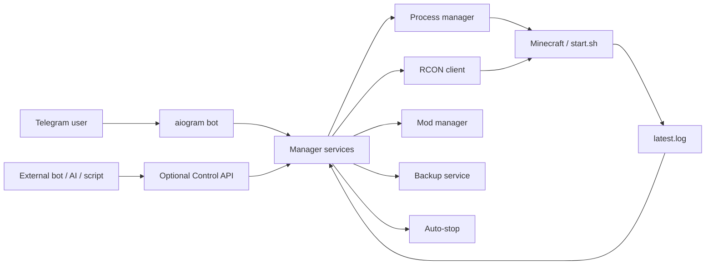

# 🎮 Telegram Minecraft Server Manager

Control all configured Linux Minecraft servers from one Telegram bot: start/stop/restart, RCON console, status, mods, backups, event-driven auto-stop and selected server events. An optional HTTP Control API lets external bots, AI agents and automation systems use the same manager.

> Built with Python 3.11+ and aiogram 3.x. Minecraft itself does **not** need to be managed by systemd.

[Русская версия](README_RU.md)

## Why this project

This is a small self-hosted control panel for private Minecraft servers. The bot runs separately from Minecraft and starts each server process directly from its configured command.

That means you can use your existing launch script:

```env
SERVER_START_COMMAND=./start.sh
```

or launch Java directly:

```env
SERVER_START_COMMAND=java -Xms2G -Xmx6G -jar fabric-server-launch.jar nogui
```

No `sudo systemctl minecraft ...`, no broad sudoers rule, and no hard-coded JAR path in the bot.

## Features

| Feature | What it does |
| --- | --- |
| ▶️ Process control | Start, stop and restart Minecraft directly |
| 📊 Status | PID, uptime, process-tree RAM and online players |
| 💻 RCON console | Run Minecraft commands from an isolated Telegram console mode |
| 🧩 Mod manager | List, upload and delete `.jar` mods |
| 💾 Backups | Create RCON-coordinated ZIP backups with saves paused and flushed |
| 📜 Logs | Show launch output without mixing it with the activity history |\n| 📋 Event history | Separate Telegram tab with persistent daily join/leave/chat/death and server lifecycle logs |
| ⏱ Auto-stop | Stop an empty server after a configurable timeout, driven locally by join/leave events |
| 🔌 Control API | Optional bearer-authenticated HTTP/OpenAPI interface for bots, AI agents and scripts |
| 🔐 Access control | `OWNER_IDS` plus per-user roles and permissions from `users.json` |

## Architecture


```mermaid
flowchart LR
    TG[Telegram user] --> BOT[aiogram bot]
    EXT[External bot / AI / script] --> API[Optional Control API]
    BOT --> CORE[Manager services]
    API --> CORE
    CORE --> PM[Process manager]
    CORE --> RCON[RCON client]
    CORE --> MODS[Mod manager]
    CORE --> BACKUP[Backup service]
    CORE --> AUTO[Auto-stop]
    PM --> MC[Minecraft / start.sh]
    RCON --> MC
    MC --> LOG[latest.log]
    LOG --> CORE
```

The process manager stores PID + process creation time. This lets the bot reconnect to the same managed process after the bot itself restarts while reducing PID-reuse mistakes.

## Quick start

### 1. Clone and install

```bash
git clone https://github.com/sqwiziiy/Telegram-Minecraft-Server-Manager.git
cd Telegram-Minecraft-Server-Manager

python3 -m venv .venv
source .venv/bin/activate
pip install -r requirements.txt
```

### 2. Configure

```bash
cp .env.example .env
nano .env
```

Minimum useful configuration:

```env
BOT_TOKEN=123456:replace_me
OWNER_IDS=123456789
MINECRAFT_SERVERS_FILE=./servers.json
DEFAULT_SERVER_ID=storm-survival
STORM_SURVIVAL_RCON_PASSWORD=replace_me
```

### Granular access for other users

Owners are configured in `.env` and always have full access:

```env
OWNER_IDS=123456789
```

For friends or other users, copy the example access policy:

```bash
cp users.example.json users.json
nano users.json
```

Example for a friend who may start, stop and restart the server and view **mods plus the separate event history**:

```json
{
  "users": {
    "987654321": {
      "name": "Friend",
      "servers": {
        "storm-survival": {
          "role": "operator",
          "allow": [],
          "deny": []
        }
      }
    }
  }
}
```

The built-in `operator` role grants only:

- `server.status`
- `server.start`
- `server.stop`
- `server.restart`
- `server.autostop`
- `mods.view`

It can view the separate server event history, but does not grant RCON console access, mod upload/delete, raw launch logs, host system information or backups. Unauthorized buttons are hidden, and every sensitive handler/callback also checks the permission server-side.

Use `role: "custom"` for an empty baseline, or adjust a preset with `allow` and `deny`. `deny` always wins.

Restart the bot after editing `users.json` so the policy is reloaded.

Your `start.sh` should keep Minecraft in the foreground. Do **not** end it with `&` or daemonize Java.

Example:

```bash
#!/usr/bin/env bash
exec java -Xms2G -Xmx6G -jar fabric-server-launch.jar nogui
```

Enable RCON in `server.properties`:

```properties
enable-rcon=true
rcon.port=25575
rcon.password=replace_me
```

### 3. Run the bot

```bash
source .venv/bin/activate
python main.py
```

The Minecraft server is then started from Telegram → **/start** → choose a server → **⚙️ Управление** → **▶️ Запустить**. Auto-stop is configured from the same server screen through **⏱ Auto-stop** and works without the external API or any AI client. **📋 События** opens a separate persistent activity/history view; daily files are stored under `logs/events/YYYY-MM-DD.log` inside each server directory.

## Running the bot with systemd

Using systemd for the **bot** is still useful. Only Minecraft process control was removed from systemd.

**Important:** the bot launches Minecraft as a child process and later reconnects to it through the persisted PID record. Therefore the bot unit must use `KillMode=process`. The systemd default, `KillMode=control-group`, kills the Minecraft Java process together with the Telegram bot on `systemctl stop`, restart, or a service restart after failure. With `KillMode=process`, stopping/restarting the bot only terminates the bot's main Python process; Minecraft remains running and the next bot instance detects the same managed server.

```ini
[Unit]
Description=Telegram Minecraft Server Manager
After=network-online.target
Wants=network-online.target

[Service]
Type=simple
User=mcbot
WorkingDirectory=/opt/telegram-minecraft-server-manager
ExecStart=/opt/telegram-minecraft-server-manager/.venv/bin/python main.py
EnvironmentFile=/opt/telegram-minecraft-server-manager/.env
Restart=on-failure
RestartSec=5

# Minecraft processes are deliberately independent from the bot lifecycle.
# Without this, systemd's default KillMode=control-group kills Java when the
# Telegram manager is stopped or restarted.
KillMode=process

[Install]
WantedBy=multi-user.target
```

A ready-to-copy example is also available at `deploy/systemd/telegram-minecraft-server-manager.service`.

In modern mode, the `mcbot` user must have normal filesystem permissions for every configured server's `server_dir`, mods, world, backups, Minecraft/manager logs and PID file paths from `servers.json`. The legacy `.env` fallback uses the corresponding legacy paths. It does not need passwordless sudo just to control Minecraft.

## Configuration

| Variable | Purpose |
| --- | --- |
| `BOT_TOKEN` | Telegram bot token |
| `OWNER_IDS` | Full-access owner Telegram IDs, comma-separated |\n| `ADMIN_IDS` | Legacy full-access list kept for v1.0 compatibility |\n| `ACCESS_USERS_FILE` | Path to `users.json` with roles and permissions |
| `MINECRAFT_SERVERS_FILE` | JSON registry containing every server |
| `DEFAULT_SERVER_ID` | Default server ID; must exist in the registry |
| `SERVER_*`, `RCON_*`, path variables | Deprecated legacy fallback, used only when the registry is missing/empty |
| `MAX_MOD_UPLOAD_MB` | Maximum Telegram mod upload size |
| `AUTO_STOP_STATE_FILE` | Persistent auto-stop override state |
| `AUTO_STOP_DEFAULT_SECONDS` | Default empty-server timeout; `0` disables it |
| `CONTROL_API_ENABLED` | Enable the optional external HTTP Control API |
| `CONTROL_API_HOST`, `CONTROL_API_PORT` | Control API bind address and port |
| `CONTROL_API_TOKEN` | Bearer token for external API clients |

## Security notes

- Every message and callback is authenticated, while sensitive actions also require their specific permission.
- Minecraft commands go through RCON; the bot does not expose a Linux shell.
- Server startup uses an argv list and never `shell=True`.
- RCON packet sizes are bounded before allocation.
- Live backups pause saves, flush the world, archive it, then re-enable saves.
- Telegram/RCON/log/file-name content is HTML-escaped before being rendered.
- Mod uploads reject traversal names, enforce a size limit and refuse overwriting existing paths.
- Secrets belong in `.env`; `.env` is ignored by Git and CI checks for common accidental secret patterns.
- `OWNER_IDS` and legacy `ADMIN_IDS` retain full access; `users.json` users receive only their effective permissions.

## Project structure

```text
.
├── main.py
├── config.py
├── handlers/
│   ├── console.py
│   ├── mods.py
│   ├── start.py
│   ├── status.py
│   └── system.py
├── keyboards/
├── middlewares/
│   └── auth.py
├── services/
│   ├── auto_stop.py
│   ├── backup.py
│   ├── control_api.py
│   ├── event_history.py
│   ├── log_monitor.py
│   ├── rcon.py
│   ├── server_process.py
│   └── server_registry.py
├── docs/
│   └── CONTROL_API.md
└── .github/workflows/ci.yml
```

## Multi-server configuration

All modern servers, including Storm Survival, are configured in `servers.json`. Their RCON secrets stay in `.env` via `rcon_password_env`. PID/output logs, Minecraft logs, mods, world and backup paths default to locations relative to `server_dir`.

One bot presents a server picker and only shows servers assigned to the current Telegram user. Access is configured per server in `users.json`; owners and legacy admins have full access to every configured server. A legacy user entry without `servers` applies only to the default server.

Host CPU/RAM/disk information is global and is available only to owners and legacy admins through the top-level `🖥 Хост` button; it is not granted by access to an individual Minecraft server.

Use unique RCON ports when multiple servers run simultaneously.

## Current scope

This project is intentionally small and focused on trusted private servers. It is not a multi-tenant hosting panel and should not be exposed as a public bot.


## Optional external Control API

The HTTP API is an integration layer, not a requirement for the manager. Telegram control,
auto-stop, process management and event handling keep working when the API is disabled.

It is suitable for **any trusted external client**: AI assistants, Open WebUI/Jarvis,
other bots, dashboards, automation systems or local scripts. The OpenAPI schema exposes
stable operation IDs such as `minecraft_status`, `minecraft_set_auto_stop` and
`minecraft_rcon`, so AI/agent clients can import them as tools.

Read-only event history is available through `minecraft_events`. File inspection is also available for crash reports, logs and configuration
diagnostics, with traversal protection and secret redaction.

See **[docs/CONTROL_API.md](docs/CONTROL_API.md)** for configuration, authentication,
the complete read-only/write operation list and examples.

Legacy `JARVIS_API_*` environment variables remain supported, but new installations
should use `CONTROL_API_*`.
