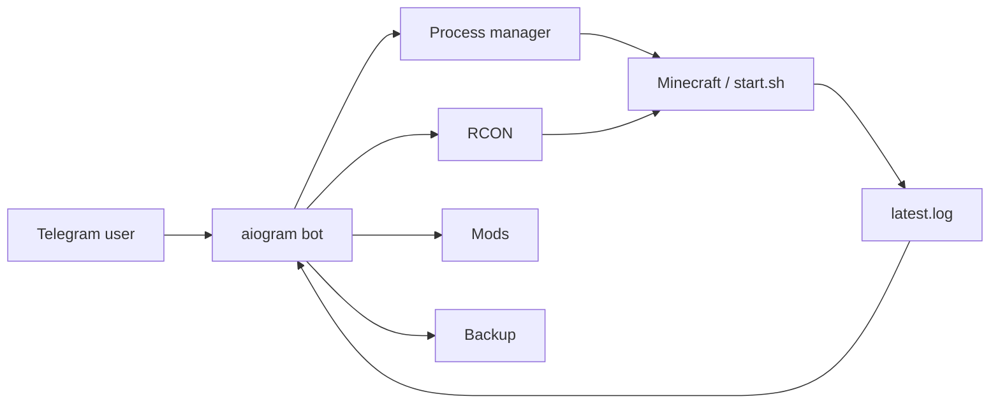

# 🎮 Telegram Minecraft Server Manager

Небольшая self-hosted панель для управления Minecraft-сервером прямо из Telegram: запуск, остановка, рестарт, RCON-консоль, статус, моды, бэкапы и события из логов.

> Python 3.11+ · aiogram 3.x. Сам Minecraft **не обязан** работать через systemd.

[English README](README.md)

## Что изменилось

Главная идея проекта теперь простая: бот сам управляет процессом Minecraft и не вызывает `sudo systemctl minecraft ...`.

Можно запускать существующий скрипт:

```env
SERVER_START_COMMAND=./start.sh
```

или Java напрямую:

```env
SERVER_START_COMMAND=java -Xms2G -Xmx6G -jar fabric-server-launch.jar nogui
```

То есть больше не нужен отдельный Minecraft unit и sudoers-правило ради кнопок Start/Stop/Restart.

## Возможности

| Раздел | Что умеет |
| --- | --- |
| ▶️ Управление процессом | Запуск, остановка и рестарт Minecraft |
| 📊 Статус | PID, uptime, RAM дерева процессов и список игроков |
| 💻 RCON-консоль | Выполнение Minecraft-команд из Telegram |
| 🧩 Моды | Просмотр, загрузка и удаление `.jar` |
| 💾 Бэкапы | Согласованный ZIP-бэкап через `save-off` → `save-all flush` → `save-on` |
| 📜 Логи | Последние строки запуска + уведомления о событиях сервера |
| 🔐 Доступ | `OWNER_IDS` + роли и отдельные permissions из `users.json` |

## Как это устроено



Process manager сохраняет PID и время создания процесса. Поэтому после перезапуска самого бота он может снова узнать управляемый Minecraft-процесс и не спутать его с другим процессом после PID reuse.

## Быстрый запуск

### 1. Установка

```bash
git clone https://github.com/sqwiziiy/Telegram-Minecraft-Server-Manager.git
cd Telegram-Minecraft-Server-Manager

python3 -m venv .venv
source .venv/bin/activate
pip install -r requirements.txt
```

### 2. Конфиг

```bash
cp .env.example .env
nano .env
```

Минимум:

```env
BOT_TOKEN=123456:replace_me
OWNER_IDS=123456789

SERVER_DIR=/srv/minecraft
SERVER_START_COMMAND=./start.sh

RCON_HOST=127.0.0.1
RCON_PORT=25575
RCON_PASSWORD=replace_me
```

### Гибкий доступ для других пользователей

Владелец задаётся в `.env` и всегда имеет полный доступ:

```env
OWNER_IDS=123456789
```

Для друзей и других пользователей скопируйте пример политики:

```bash
cp users.example.json users.json
nano users.json
```

Например, профиль друга с запуском/остановкой/рестартом и **только просмотром модов**:

```json
{
  "users": {
    "987654321": {
      "name": "Friend",
      "role": "operator",
      "allow": [],
      "deny": []
    }
  }
}
```

Роль `operator` даёт только:

- `server.status`
- `server.start`
- `server.stop`
- `server.restart`
- `mods.view`

Консоль, удаление/загрузка модов, логи, системная информация и бэкапы для неё закрыты. Кнопки без прав не показываются, но главное — каждый handler и callback дополнительно проверяет permission на backend.

Для кастомной настройки используйте `role: "custom"` и `allow`, либо добавляйте/убирайте отдельные права через `allow` / `deny`. `deny` всегда имеет приоритет.

После изменения `users.json` перезапустите бота, чтобы перечитать политику доступа.

Нормальный `start.sh`:

```bash
#!/usr/bin/env bash
exec java -Xms2G -Xmx6G -jar fabric-server-launch.jar nogui
```

Важно: сервер должен оставаться foreground-процессом. Не запускайте Java через `&` и не daemonize её внутри `start.sh`.

В `server.properties`:

```properties
enable-rcon=true
rcon.port=25575
rcon.password=replace_me
```

### 3. Запуск бота

```bash
source .venv/bin/activate
python main.py
```

После этого Minecraft запускается через Telegram → **⚙️ Система** → **▶️ Запустить**.

## systemd для самого бота

Для бота systemd оставить полезно. Мы убрали зависимость от systemd только для управления Minecraft.

```ini
[Unit]
Description=Telegram Minecraft Server Manager
After=network-online.target
Wants=network-online.target

[Service]
Type=simple
User=mcbot
WorkingDirectory=/opt/telegram-minecraft-server-manager
ExecStart=/opt/telegram-minecraft-server-manager/.venv/bin/python main.py
EnvironmentFile=/opt/telegram-minecraft-server-manager/.env
Restart=on-failure
RestartSec=5

[Install]
WantedBy=multi-user.target
```

Пользователю `mcbot` нужны обычные права на `SERVER_DIR`, папку модов, мира, бэкапов и файлы PID/логов. Passwordless sudo для управления Minecraft больше не нужен.

## Переменные окружения

| Переменная | Что задаёт |
| --- | --- |
| `BOT_TOKEN` | Токен Telegram-бота |
| `OWNER_IDS` | Telegram ID владельцев с полным доступом |\n| `ADMIN_IDS` | Legacy-список полного доступа для совместимости с v1.0 |\n| `ACCESS_USERS_FILE` | Путь к `users.json` с ролями и permissions |
| `SERVER_DIR` | Рабочая папка Minecraft |
| `SERVER_START_COMMAND` | Команда запуска, включая `.sh` |
| `SERVER_PID_FILE` | PID + metadata управляемого процесса |
| `SERVER_OUTPUT_LOG` | stdout/stderr процесса запуска |
| `SERVER_STOP_TIMEOUT` | Сколько ждать graceful stop через RCON |
| `RCON_HOST`, `RCON_PORT` | RCON endpoint |
| `RCON_PASSWORD` | RCON пароль |
| `MINECRAFT_LOG_PATH` | Путь к `latest.log` |
| `MODS_DIR` | Папка модов |
| `WORLD_DIR` | Мир для бэкапа |
| `BACKUP_DIR` | Папка бэкапов |
| `MAX_MOD_UPLOAD_MB` | Максимальный размер загружаемого мода |

## Безопасность

- Все сообщения и callback сначала проходят общую авторизацию, а опасные действия дополнительно проверяют конкретный permission.
- Linux shell через Telegram не предоставляется: Minecraft-команды идут через RCON.
- Запуск сервера выполняется без `shell=True`.
- Размер входящего RCON-пакета проверяется до чтения.
- При бэкапе живого сервера сохранения временно выключаются, мир принудительно flush-ится и после архива снова включаются.
- Вывод RCON, логов, имён файлов и ошибок экранируется перед HTML-разметкой Telegram.
- Загрузка модов ограничена по размеру, path traversal блокируется, существующие файлы не перезаписываются.
- Секреты хранятся только в `.env`; CI дополнительно проверяет типичные случайно закоммиченные токены/пароли.
- `OWNER_IDS` и legacy `ADMIN_IDS` имеют полный доступ; пользователи из `users.json` получают только явно разрешённые возможности.

## Структура

```text
.
├── main.py
├── config.py
├── handlers/
│   ├── console.py
│   ├── mods.py
│   ├── start.py
│   ├── status.py
│   └── system.py
├── keyboards/
├── middlewares/
│   └── auth.py
├── services/
│   ├── backup.py
│   ├── log_monitor.py
│   ├── rcon.py
│   └── server_process.py
└── .github/workflows/ci.yml
```

## Границы проекта

Это менеджер одного доверенного приватного сервера, а не публичная multi-user hosting-панель. Бота не стоит открывать для незнакомых пользователей.
