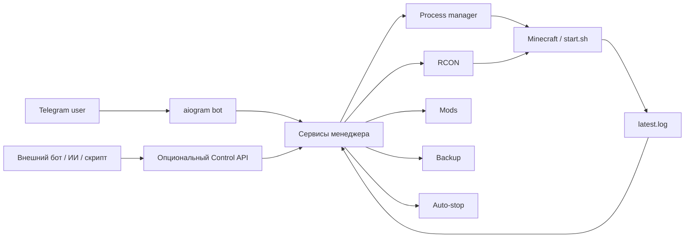

# 🎮 Telegram Minecraft Server Manager

Небольшая self-hosted панель для управления всеми настроенными Minecraft-серверами из одного Telegram-бота: запуск, остановка, рестарт, RCON-консоль, статус, моды, бэкапы, событийный auto-stop и события из логов. Опциональный HTTP Control API позволяет подключать внешних ботов, ИИ-агентов и автоматизацию.

> Python 3.11+ · aiogram 3.x. Сам Minecraft **не обязан** работать через systemd.

[English README](README.md)

## Что изменилось

Главная идея проекта теперь простая: бот сам управляет процессом Minecraft и не вызывает `sudo systemctl minecraft ...`.

Можно запускать существующий скрипт:

```env
SERVER_START_COMMAND=./start.sh
```

или Java напрямую:

```env
SERVER_START_COMMAND=java -Xms2G -Xmx6G -jar fabric-server-launch.jar nogui
```

То есть больше не нужен отдельный Minecraft unit и sudoers-правило ради кнопок Start/Stop/Restart.

## Возможности

| Раздел | Что умеет |
| --- | --- |
| ▶️ Управление процессом | Запуск, остановка и рестарт Minecraft |
| 📊 Статус | PID, uptime, RAM дерева процессов и список игроков |
| 💻 RCON-консоль | Выполнение Minecraft-команд из Telegram |
| 🧩 Моды | Просмотр, загрузка и удаление `.jar` |
| 💾 Бэкапы | Согласованный ZIP-бэкап через `save-off` → `save-all flush` → `save-on` |
| 📜 Логи | Последние строки запуска отдельно от истории активности |\n| 📋 История событий | Отдельная вкладка Telegram + постоянные дневные логи входов/выходов/смертей/чата и запусков/остановок |
| ⏱ Auto-stop | Локально выключает пустой сервер после заданного таймаута по событиям входа/выхода |
| 🔌 Control API | Опциональный HTTP/OpenAPI интерфейс с Bearer auth для ботов, ИИ-агентов и скриптов |
| 🔐 Доступ | `OWNER_IDS` + роли и отдельные permissions из `users.json` |

## Как это устроено


```mermaid
flowchart LR
    TG[Telegram user] --> BOT[aiogram bot]
    EXT[Внешний бот / ИИ / скрипт] --> API[Опциональный Control API]
    BOT --> CORE[Сервисы менеджера]
    API --> CORE
    CORE --> PM[Process manager]
    CORE --> RCON[RCON]
    CORE --> MODS[Mods]
    CORE --> BACKUP[Backup]
    CORE --> AUTO[Auto-stop]
    PM --> MC[Minecraft / start.sh]
    RCON --> MC
    MC --> LOG[latest.log]
    LOG --> CORE
```

Process manager сохраняет PID и время создания процесса. Поэтому после перезапуска самого бота он может снова узнать управляемый Minecraft-процесс и не спутать его с другим процессом после PID reuse.

## Быстрый запуск

### 1. Установка

```bash
git clone https://github.com/sqwiziiy/Telegram-Minecraft-Server-Manager.git
cd Telegram-Minecraft-Server-Manager

python3 -m venv .venv
source .venv/bin/activate
pip install -r requirements.txt
```

### 2. Конфиг

```bash
cp .env.example .env
nano .env
```

Минимум:

```env
BOT_TOKEN=123456:replace_me
OWNER_IDS=123456789
MINECRAFT_SERVERS_FILE=./servers.json
DEFAULT_SERVER_ID=storm-survival
STORM_SURVIVAL_RCON_PASSWORD=replace_me
```

### Гибкий доступ для других пользователей

Владелец задаётся в `.env` и всегда имеет полный доступ:

```env
OWNER_IDS=123456789
```

Для друзей и других пользователей скопируйте пример политики:

```bash
cp users.example.json users.json
nano users.json
```

Например, профиль друга с запуском/остановкой/рестартом и **только просмотром модов**:

```json
{
  "users": {
    "987654321": {
      "name": "Friend",
      "servers": {
        "storm-survival": {
          "role": "operator",
          "allow": [],
          "deny": []
        }
      }
    }
  }
}
```

Роль `operator` даёт только:

- `server.status`
- `server.start`
- `server.stop`
- `server.restart`
- `server.autostop`
- `mods.view`

Отдельную историю событий роль `operator` видеть может, а RCON-консоль, удаление/загрузка модов, raw launch-логи, системная информация и бэкапы для неё закрыты. Кнопки без прав не показываются, но главное — каждый handler и callback дополнительно проверяет permission на backend.

Для кастомной настройки используйте `role: "custom"` и `allow`, либо добавляйте/убирайте отдельные права через `allow` / `deny`. `deny` всегда имеет приоритет.

После изменения `users.json` перезапустите бота, чтобы перечитать политику доступа.

Нормальный `start.sh`:

```bash
#!/usr/bin/env bash
exec java -Xms2G -Xmx6G -jar fabric-server-launch.jar nogui
```

Важно: сервер должен оставаться foreground-процессом. Не запускайте Java через `&` и не daemonize её внутри `start.sh`.

В `server.properties`:

```properties
enable-rcon=true
rcon.port=25575
rcon.password=replace_me
```

### 3. Запуск бота

```bash
source .venv/bin/activate
python main.py
```

После этого Minecraft запускается через Telegram → **/start** → выбрать сервер → **⚙️ Управление** → **▶️ Запустить**. Auto-stop настраивается прямо на экране сервера через **⏱ Auto-stop** и работает независимо от внешнего API и любого ИИ. **📋 События** открывает отдельную историю, а дневные файлы сохраняются внутри каждого сервера в `logs/events/YYYY-MM-DD.log`.

## systemd для самого бота

Для бота systemd оставить полезно. Мы убрали зависимость от systemd только для управления Minecraft.

```ini
[Unit]
Description=Telegram Minecraft Server Manager
After=network-online.target
Wants=network-online.target

[Service]
Type=simple
User=mcbot
WorkingDirectory=/opt/telegram-minecraft-server-manager
ExecStart=/opt/telegram-minecraft-server-manager/.venv/bin/python main.py
EnvironmentFile=/opt/telegram-minecraft-server-manager/.env
Restart=on-failure
RestartSec=5

[Install]
WantedBy=multi-user.target
```

В современном режиме пользователю `mcbot` нужны обычные права на `server_dir`, папки модов, мира, бэкапов, Minecraft/manager-логи и PID-файлы каждого сервера из `servers.json`. Legacy fallback использует соответствующие старые пути из `.env`. Passwordless sudo для управления Minecraft больше не нужен.

## Переменные окружения

| Переменная | Что задаёт |
| --- | --- |
| `BOT_TOKEN` | Токен Telegram-бота |
| `OWNER_IDS` | Telegram ID владельцев с полным доступом |\n| `ADMIN_IDS` | Legacy-список полного доступа для совместимости с v1.0 |\n| `ACCESS_USERS_FILE` | Путь к `users.json` с ролями и permissions |
| `MINECRAFT_SERVERS_FILE` | JSON-реестр всех серверов |
| `DEFAULT_SERVER_ID` | ID сервера по умолчанию; должен быть в реестре |
| `SERVER_*`, `RCON_*` и переменные путей | Устаревший fallback, только если реестр отсутствует/пуст |
| `MAX_MOD_UPLOAD_MB` | Максимальный размер загружаемого мода |
| `AUTO_STOP_STATE_FILE` | Файл сохранённого состояния auto-stop |
| `AUTO_STOP_DEFAULT_SECONDS` | Таймаут пустого сервера по умолчанию; `0` отключает функцию |
| `CONTROL_API_ENABLED` | Включить опциональный внешний HTTP Control API |
| `CONTROL_API_HOST`, `CONTROL_API_PORT` | Адрес и порт Control API |
| `CONTROL_API_TOKEN` | Bearer-токен для внешних клиентов API |

## Безопасность

- Все сообщения и callback сначала проходят общую авторизацию, а опасные действия дополнительно проверяют конкретный permission.
- Linux shell через Telegram не предоставляется: Minecraft-команды идут через RCON.
- Запуск сервера выполняется без `shell=True`.
- Размер входящего RCON-пакета проверяется до чтения.
- При бэкапе живого сервера сохранения временно выключаются, мир принудительно flush-ится и после архива снова включаются.
- Вывод RCON, логов, имён файлов и ошибок экранируется перед HTML-разметкой Telegram.
- Загрузка модов ограничена по размеру, path traversal блокируется, существующие файлы не перезаписываются.
- Секреты хранятся только в `.env`; CI дополнительно проверяет типичные случайно закоммиченные токены/пароли.
- `OWNER_IDS` и legacy `ADMIN_IDS` имеют полный доступ; пользователи из `users.json` получают только явно разрешённые возможности.

## Структура

```text
.
├── main.py
├── config.py
├── handlers/
│   ├── console.py
│   ├── mods.py
│   ├── start.py
│   ├── status.py
│   └── system.py
├── keyboards/
├── middlewares/
│   └── auth.py
├── services/
│   ├── auto_stop.py
│   ├── backup.py
│   ├── control_api.py
│   ├── event_history.py
│   ├── log_monitor.py
│   ├── rcon.py
│   ├── server_process.py
│   └── server_registry.py
├── docs/
│   └── CONTROL_API.md
└── .github/workflows/ci.yml
```

## Несколько серверов

Все современные серверы, включая Storm Survival, задаются в `servers.json`. Секреты RCON остаются только в `.env` и подключаются через `rcon_password_env`. Пути PID, логов, модов, мира и бэкапов можно указать явно или получить относительно `server_dir`.

Один бот показывает пользователю только назначенные ему серверы. Права в `users.json` задаются внутри `servers`; владельцы и legacy-администраторы имеют полный доступ ко всем серверам. Старый профиль без `servers` действует только для сервера по умолчанию. При одновременном запуске нескольких серверов используйте уникальные RCON-порты.

Информация о CPU/RAM/диске хоста глобальна и доступна только владельцам и legacy-администраторам через кнопку `🖥 Хост`; доступ к отдельному Minecraft-серверу её не выдаёт.

## Границы проекта

Это менеджер доверенных приватных серверов, а не публичная multi-user hosting-панель. Бота не стоит открывать для незнакомых пользователей.


## Опциональный внешний Control API

HTTP API — это **интеграционный слой**, а не обязательная часть работы менеджера.
Telegram-управление, auto-stop, управление процессами и обработка событий продолжают
работать, даже если API полностью выключен.

API подходит для **любого доверенного внешнего клиента**: ИИ-ассистента, Open WebUI/Jarvis,
другого Telegram/Discord-бота, панели, системы автоматизации или локального скрипта.
OpenAPI-схема содержит стабильные operation ID вроде `minecraft_status`,
`minecraft_set_auto_stop` и `minecraft_rcon`, поэтому ИИ/agent-клиенты могут
подключать их как инструменты.

История событий доступна через read-only операцию `minecraft_events`. Для диагностики также доступны операции чтения crash-reports, логов и других файлов
внутри каталога Minecraft-сервера. Выход за `server_dir` блокируется, чувствительные
файлы и очевидные секреты защищены.

Полная документация, разделение READ-ONLY / WRITE, настройка Bearer auth и примеры:
**[docs/CONTROL_API.md](docs/CONTROL_API.md)**.

Старые переменные `JARVIS_API_*` сохранены для совместимости. Для новых установок
используйте `CONTROL_API_*`.
