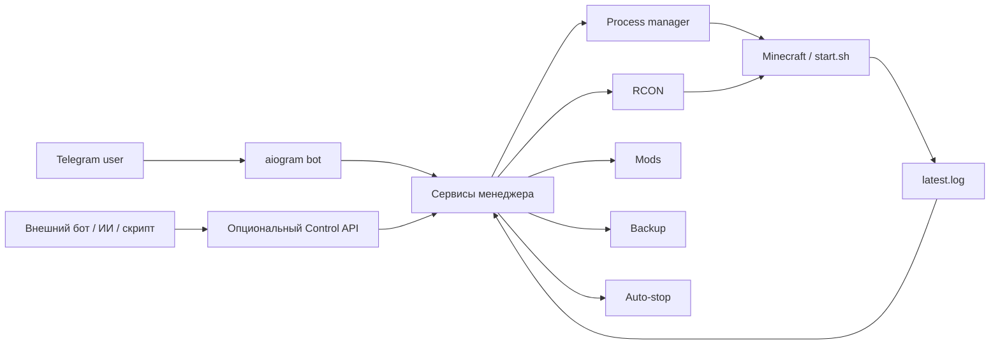

# 🎮 Telegram Minecraft Server Manager

Небольшая self-hosted панель для управления всеми настроенными Minecraft-серверами из одного Telegram-бота: запуск, остановка, рестарт, RCON-консоль, статус, моды, бэкапы, событийный auto-stop и события из логов. Опциональный HTTP Control API позволяет подключать внешних ботов, ИИ-агентов и автоматизацию.

> Python 3.11+ · aiogram 3.x. Сам Minecraft **не обязан** работать через systemd.

[English README](README.md)

## Что изменилось

Главная идея проекта теперь простая: бот сам управляет процессом Minecraft и не вызывает `sudo systemctl minecraft ...`.

Можно запускать существующий скрипт:

```env
SERVER_START_COMMAND=./start.sh
```

или Java напрямую:

```env
SERVER_START_COMMAND=java -Xms2G -Xmx6G -jar fabric-server-launch.jar nogui
```

То есть больше не нужен отдельный Minecraft unit и sudoers-правило ради кнопок Start/Stop/Restart.

## Возможности

| Раздел | Что умеет |
| --- | --- |
| ▶️ Управление процессом | Запуск, остановка и рестарт Minecraft |
| 📊 Статус | PID, uptime, RAM дерева процессов и список игроков |
| 💻 RCON-консоль | Выполнение Minecraft-команд из Telegram |
| 🧩 Моды | Просмотр, загрузка и удаление `.jar` |
| 💾 Бэкапы | Ручной согласованный ZIP-бэкап через `save-off` → `save-all flush` → `save-on` |
| 📜 Логи | Последние строки запуска в той же панели Telegram с обновлением и кнопкой «Назад» |
| 📋 История событий | Отдельная вкладка Telegram + постоянные дневные логи входов/выходов/смертей/чата и запусков/остановок |
| ⚙️ Автозадачи | Auto-stop пустого сервера и интервальный автобэкап только при выключенном Minecraft |
| 🔌 Control API | Опциональный HTTP/OpenAPI интерфейс с Bearer auth для ботов, ИИ-агентов и скриптов |
| 🔐 Доступ | `OWNER_IDS` + роли и отдельные permissions из `users.json` |

## Как это устроено


```mermaid
flowchart LR
    TG[Telegram user] --> BOT[aiogram bot]
    EXT[Внешний бот / ИИ / скрипт] --> API[Опциональный Control API]
    BOT --> CORE[Сервисы менеджера]
    API --> CORE
    CORE --> PM[Process manager]
    CORE --> RCON[RCON]
    CORE --> MODS[Mods]
    CORE --> BACKUP[Backup]
    CORE --> AUTO[Auto-stop]
    PM --> MC[Minecraft / start.sh]
    RCON --> MC
    MC --> LOG[latest.log]
    LOG --> CORE
```

Process manager сохраняет PID и время создания процесса. Поэтому после перезапуска самого бота он может снова узнать управляемый Minecraft-процесс и не спутать его с другим процессом после PID reuse.

## Быстрый запуск

### 1. Установка

```bash
git clone https://github.com/sqwiziiy/Telegram-Minecraft-Server-Manager.git
cd Telegram-Minecraft-Server-Manager

python3 -m venv .venv
source .venv/bin/activate
pip install -r requirements.txt
```

### 2. Конфиг

```bash
cp .env.example .env
nano .env
```

Минимум:

```env
BOT_TOKEN=123456:replace_me
OWNER_IDS=123456789
MINECRAFT_SERVERS_FILE=./servers.json
DEFAULT_SERVER_ID=storm-survival
STORM_SURVIVAL_RCON_PASSWORD=replace_me
```

### Резервные копии конфигурации

Оба мастера (`scripts/manage_users.py` и `scripts/manage_servers.py`) складывают новые копии изменяемых файлов в единую **`config_backups/`** в корне проекта бота. Там появляются `users.json.bak-...`, `servers.json.bak-...`, `.env.bak-...`, `test-server-server.properties.bak-...`. Скрипты не засоряют папки Minecraft и не переносят автоматически старые файлы `.bak-*`, созданные предыдущими версиями.

Эта папка исключена из Git. **Не путать с ZIP-бэкапами миров Minecraft:** они по-прежнему находятся в своих папках `backups/` у каждого Minecraft-сервера.

## 🌐 Удалённые Minecraft-серверы через SSH (экспериментальная ветка)

**Доступно для тестирования только в ветке `feat/remote-ssh-servers`, не в `main`.** Бот может работать на одном Linux-ПК, а Minecraft — на другом. В Telegram будут доступны запуск, остановка, рестарт, состояние процесса, RCON, моды, логи, события, автостоп, ручные и автоматические ZIP-бэкапы и лимиты хранения. Файлы и архивы мира остаются **на удалённом хосте**, не копируются автоматически на ПК бота.

### Подготовка удалённого компьютера

На удалённом Linux должны быть OpenSSH-server, Python 3.10+ и уже установленный Minecraft-сервер с рабочим скриптом запуска. Для входа используй отдельного Unix-пользователя с правами к папке Minecraft, без `sudo`. На компьютере **бота**:

```bash
ssh-keygen -t ed25519 -f ~/.ssh/minecraft_manager
ssh-copy-id -i ~/.ssh/minecraft_manager.pub minecraft@192.168.1.50
ssh -i ~/.ssh/minecraft_manager minecraft@192.168.1.50
```

Адрес и имя `minecraft` — только примеры. При первом SSH-подключении сверяй fingerprint ключа сервера с тем, что показывает администратор удалённой машины. Только после проверки подтверждай добавление в `~/.ssh/known_hosts`. **Не выключай проверку host key**. Настрой доступ так, чтобы пользователь systemd-сервиса бота мог пользоваться тем же приватным ключом и `known_hosts`. Если ключ с passphrase, нужен работающий `ssh-agent` для сервиса.

Если машины в разных сетях или у друга, безопаснее соединить их через WireGuard/Tailscale, не выставляя Minecraft RCON в публичный интернет. SSH-порт можно разрешить только VPN-узлам. Порт игры (обычно 25565) настраивается отдельно для игроков.

### Подключение из мастера

```bash
python3 scripts/manage_servers.py
```

Выбери **2 — Удалённый Linux-сервер (SSH)**. Дальше введи IP/домен, SSH-пользователя, порт SSH (обычно 22), абсолютный путь к приватному ключу, путь к `known_hosts`, **путь к Minecraft на удалённом компьютере**, название, ID, команду запуска, игровой и RCON-порты. Мастер проверит SSH, каталог, занятость портов. Пароль RCON сохранится только в локальном `.env` и удалённом `server.properties`; в терминале он не показывается. Подтверди изменения. Старый `server.properties` сохраняется в локальной папке `config_backups/`, как и остальные конфиги.

Удалённый агент передаётся внутри SSH-команды и **не требует установки постоянного HTTP/API-демона** на втором компьютере. На удалённом хосте не нужно ставить зависимости Python из нашего `requirements.txt`: агент использует стандартную библиотеку Python. RCON выполняется на `127.0.0.1` **удалённого ПК**.

Новые пользователи **не получают** доступ к удалённому серверу автоматически — назначай его через `python3 scripts/manage_users.py`. После настройки перезапусти локальный сервис `telegram-minecraft-manager.service`.

### Ограничения и безопасность

- Для управления запуском/остановкой используй **тот же менеджер**, который запускает сервер. Если он запущен кем-то извне, бот может видеть открытые TCP-порты как признак работы, но не гарантирует статус процесса, CPU/RAM и безопасную принудительную остановку.
- SSH-соединение обязательно: при его потере статус отмечается **❔ недоступно**, а не «остановлен». Автобэкапы не должны запускаться при обрыве SSH.
- Запланированные бэкапы мира создаются **на удалённом диске только при остановленном Minecraft**; ручные при работе предварительно координируют запись с RCON. Не добавляй второй управляющий бот для того же удалённого мира.
- Host info («🖥 Хост») относится к машине бота, не к удалённому ПК.
- Режим экспериментальный: до включения на основном мире проверь всё на тестовом удалённом сервере, особенно восстановление после перезапуска, зависание SSH и восстановление ZIP.

## ➕ Добавление Minecraft-сервера через мастер

Теперь **не нужно вручную редактировать `servers.json` или переносить RCON-пароли между файлами**. Сначала подготовь папку с реально установленным Minecraft-сервером и рабочим скриптом запуска, затем выполни:

```bash
cd /home/mentality/Bots/Minecraft/fabric/1.20.1/Telegram-Minecraft-Server-Manager
python3 scripts/manage_servers.py
```

Мастер попросит: **папку сервера**, **ID** и **отображаемое название**, **команду запуска** (ищет `start-server.sh`, `start.sh`, `run.sh`), **Minecraft-порт** и **RCON-порт**. Проверяет занятые и уже используемые настроенными серверами порты, предлагает другой свободный. Если в `server.properties` уже есть пароль RCON, предлагает использовать его; иначе может автоматически сгенерировать безопасный. Пароль **не печатается в терминале**.

После подтверждения скрипт:
- дописывает только новую запись в `servers.json`, не трогая другие серверы;
- меняет только `server-port`, `enable-rcon`, `rcon.port`, `rcon.password` в папке нового сервера (сохраняя остальные свойства Minecraft);
- добавляет пароль в локальный `.env` бота, выставляя права `0600` для приватности;
- складывает резервные копии исходных конфигов **в отдельную папку `config_backups/` внутри проекта бота** (файлы `.bak-дата`, `server.properties` помечается ID сервера), записывает изменения через временные файлы; при ошибке пытается откатить ранее записанные файлы. Папка доступна только владельцу (0700), сами копии — 0600.

Новые серверы добавляются с **выключенным автостопом и автоудалением бэкапов**, без автоматической выдачи доступа другим пользователям. Доступ назначается отдельно через `python3 scripts/manage_users.py`.

**Важно:** мастер подключает существующий сервер, но не скачивает Fabric/Java и не принимает Minecraft EULA за тебя. Проверь наличие и работоспособность скрипта запуска, `eula=true`, и доступность порта при подключении с других устройств. Файл настроек считывается ботом при запуске — после сохранения запусти:

```bash
sudo systemctl restart telegram-minecraft-manager.service
```

## 🧑‍💻 Удобное управление пользователями (без редактирования JSON)

Запусти интерактивное меню прямо в терминале:

```bash
cd /home/mentality/Bots/Minecraft/fabric/1.20.1/Telegram-Minecraft-Server-Manager
python3 scripts/manage_users.py
```

Можно запускать из любой папки: скрипт сам найдёт конфигурацию в `.env`. Пакеты Python ставить отдельно не нужно; используется стандартная библиотека.

1. Выбери существующего пользователя по номеру или нажми `a`, чтобы добавить нового по Telegram ID.
2. Выбери Minecraft-сервер по номеру.
3. Выбери готовую роль: **просмотр**, **просмотр + запуск**, **оператор**, **полный доступ к серверу**; либо **выбери отдельные права**, переключая их цифрами, и нажми `s` для сохранения. Пункт **«Убрать доступ»** удалит права только на выбранный сервер.
4. Скрипт сам сохранит `users.json` с корректными скобками и создаст резервную копию **`config_backups/users.json.bak-...`** перед каждым изменением существующего файла.

Скрипт **не удаляет доступ к другим серверам**, не даёт права на серверы автоматически и не перезаписывает повреждённый JSON. Также можно переименовывать или удалять пользователей (с подтверждением). Права глобальных владельцев `OWNER_IDS` и `ADMIN_IDS` через `users.json` ограничивать нельзя.

После изменений примени права:

```bash
sudo systemctl restart telegram-minecraft-manager.service
```

## Гибкий доступ для других пользователей

Владелец задаётся в `.env` и всегда имеет полный доступ:

```env
OWNER_IDS=123456789
```

Для друзей и других пользователей скопируйте пример политики:

```bash
cp users.example.json users.json
nano users.json
```

Например, профиль друга с запуском/остановкой/рестартом и просмотром **модов плюс отдельной истории событий**:

```json
{
  "users": {
    "987654321": {
      "name": "Friend",
      "servers": {
        "storm-survival": {
          "role": "operator",
          "allow": [],
          "deny": []
        }
      }
    }
  }
}
```

Роль `operator` даёт только:

- `server.status`
- `server.start`
- `server.stop`
- `server.restart`
- `server.autostop`
- `mods.view`

Отдельную историю событий роль `operator` видеть может, а RCON-консоль, удаление/загрузка модов, raw launch-логи, системная информация, бэкапы и управление расписанием автобэкапа для неё закрыты. Право `backup.schedule` можно назначить отдельно. Кнопки без прав не показываются, но главное — каждый handler и callback дополнительно проверяет permission на backend.

Для кастомной настройки используйте `role: "custom"` и `allow`, либо добавляйте/убирайте отдельные права через `allow` / `deny`. `deny` всегда имеет приоритет.

После изменения `users.json` перезапустите бота, чтобы перечитать политику доступа.

Нормальный `start.sh`:

```bash
#!/usr/bin/env bash
exec java -Xms2G -Xmx6G -jar fabric-server-launch.jar nogui
```

Важно: сервер должен оставаться foreground-процессом. Не запускайте Java через `&` и не daemonize её внутри `start.sh`.

В `server.properties`:

```properties
enable-rcon=true
rcon.port=25575
rcon.password=replace_me
```

### 3. Запуск бота

```bash
source .venv/bin/activate
python main.py
```

После этого Minecraft запускается через Telegram → **/start** → выбрать сервер → **⚙️ Управление** → **▶️ Запустить**. Auto-stop настраивается в **⚙️ Автозадачи → ⏱ Автостоп** и работает независимо от внешнего API и любого ИИ. **⚙️ Автозадачи → 💾 Автобэкап** позволяет выбрать интервалы 6/12/24 часа или 3/7 дней. Ручной **💾 Бэкап** остаётся отдельной кнопкой. Когда наступает срок автобэкапа, активный Minecraft не останавливается: задача ждёт окончания работы сервера (проверка каждые 15 секунд), затем делает один ZIP-бэкап. При ошибке архивирования повторяет попытку не чаще раза в 5 минут. Время следующего бэкапа отсчитывается от последней успешной копии. Настройки и ожидающие задачи сохраняются между перезапусками бота. **📋 События** открывает отдельную историю, а дневные файлы сохраняются внутри каждого сервера в `logs/events/YYYY-MM-DD.log`.

## systemd для самого бота

Для бота systemd оставить полезно. Мы убрали зависимость от systemd только для управления Minecraft.

**Важно:** Minecraft запускается ботом как дочерний процесс, а после перезапуска бот находит его по сохранённому PID-файлу. Поэтому в unit самого бота обязательно нужен `KillMode=process`. Дефолтный `KillMode=control-group` у systemd при остановке или рестарте сервиса убивает не только Python-бота, но и запущенную им Java. С `KillMode=process` перезапускается только бот, Minecraft продолжает работать, а новый экземпляр менеджера подхватывает уже запущенный сервер.

```ini
[Unit]
Description=Telegram Minecraft Server Manager
After=network-online.target
Wants=network-online.target

[Service]
Type=simple
User=mcbot
WorkingDirectory=/opt/telegram-minecraft-server-manager
ExecStart=/opt/telegram-minecraft-server-manager/.venv/bin/python main.py
EnvironmentFile=/opt/telegram-minecraft-server-manager/.env
Restart=on-failure
RestartSec=5

# Minecraft должен жить независимо от процесса Telegram-бота.
# Иначе дефолтный KillMode=control-group убьёт Java при stop/restart бота.
KillMode=process

[Install]
WantedBy=multi-user.target
```

Готовый пример unit также лежит в `deploy/systemd/telegram-minecraft-server-manager.service`.

В современном режиме пользователю `mcbot` нужны обычные права на `server_dir`, папки модов, мира, бэкапов, Minecraft/manager-логи и PID-файлы каждого сервера из `servers.json`. Legacy fallback использует соответствующие старые пути из `.env`. Passwordless sudo для управления Minecraft больше не нужен.

## Переменные окружения

| Переменная | Что задаёт |
| --- | --- |
| `BOT_TOKEN` | Токен Telegram-бота |
| `OWNER_IDS` | Telegram ID владельцев с полным доступом |
| `ADMIN_IDS` | Legacy-список полного доступа для совместимости с v1.0 |
| `ACCESS_USERS_FILE` | Путь к `users.json` с ролями и permissions |
| `MINECRAFT_SERVERS_FILE` | JSON-реестр всех серверов |
| `DEFAULT_SERVER_ID` | ID сервера по умолчанию; должен быть в реестре |
| `SERVER_*`, `RCON_*` и переменные путей | Устаревший fallback, только если реестр отсутствует/пуст |
| `MAX_MOD_UPLOAD_MB` | Максимальный размер загружаемого мода |
| `HOST_DISK_PATH` | Путь файловой системы для строки диска в `🖥 Хост`; по умолчанию `/home` |
| `AUTO_STOP_STATE_FILE` | Файл сохранённого состояния auto-stop |
| `AUTO_BACKUP_STATE_FILE` | JSON-файл расписания автобэкапов, по умолчанию `auto_backup_state.json` |
| `BACKUP_RETENTION_MAX_COUNT` | Максимум автоматических архивов на сервер, `0` — без ограничения (по умолчанию) |
| `BACKUP_RETENTION_MAX_GB` | Максимальный суммарный размер автоматических архивов в ГиБ (1024³ байт), `0` — без ограничения (по умолчанию) |
| `AUTO_STOP_DEFAULT_SECONDS` | Таймаут пустого сервера по умолчанию; `0` отключает функцию |
| `CONTROL_API_ENABLED` | Включить опциональный внешний HTTP Control API |
| `CONTROL_API_HOST`, `CONTROL_API_PORT` | Адрес и порт Control API |
| `CONTROL_API_TOKEN` | Bearer-токен для внешних клиентов API |

## Очистка старых автобэкапов

**По умолчанию автоудаление полностью отключено:** `BACKUP_RETENTION_MAX_COUNT=0` и `BACKUP_RETENTION_MAX_GB=0` в `.env`.

Например, чтобы оставлять не более 5 автоматических архивов и суммарно не более 10 ГиБ:

```env
BACKUP_RETENTION_MAX_COUNT=5
BACKUP_RETENTION_MAX_GB=10
```

Лимиты действуют отдельно для каждой папки бэкапов Minecraft-сервера. В современном `servers.json` их можно **переопределить для отдельного сервера** (число или размер `0` снимает соответствующее ограничение):

```json
{
  "backup_retention_max_count": 5,
  "backup_retention_max_gb": 10
}
```

Это **поля внутри записи сервера**, не самостоятельный `servers.json`: добавьте их рядом с `auto_stop_seconds`. Явно заданные значения `servers.json` имеют приоритет над `.env`.

Очистка выполняется **после успешного нового автоматического бэкапа**, а не при запуске бота. Если превышен хотя бы один включённый лимит, архивы удаляются от самых старых до выполнения **обоих** ограничений. Бот удаляет только свои новые автоматические ZIP-архивы `world_auto_backup_YYYYMMDD_HHMMSS_microseconds.zip`; ручные `world_backup_*.zip`, посторонние файлы и символические ссылки не трогает. Архивы автобэкапов из старых версий с именем `world_backup_...` тоже не удаляются, потому что их невозможно безопасно отличить от ручных.

**Последний созданный автобэкап всегда остаётся**, даже если он один больше лимита по размеру. В этом случае бот пишет предупреждение. Для изменения настроек `.env` / `servers.json` перезапустите бота.

## Безопасность

- Все сообщения и callback сначала проходят общую авторизацию, а опасные действия дополнительно проверяют конкретный permission.
- Linux shell через Telegram не предоставляется: Minecraft-команды идут через RCON.
- Запуск сервера выполняется без `shell=True`.
- Размер входящего RCON-пакета проверяется до чтения.
- При ручном бэкапе живого сервера сохранения временно выключаются, мир принудительно flush-ится и после архива снова включаются.
- Плановые бэкапы выполняются исключительно при выключенном Minecraft; start через бота/API блокируется до окончания архивирования. Параллельные ручные и автоматические ZIP-бэкапы одного мира сериализованы.
- Лимиты хранения по количеству/размеру отключены по умолчанию и применяются исключительно к архивам автоматического расписания; ручные резервные копии не удаляются.
- Вывод RCON, логов, имён файлов и ошибок экранируется перед HTML-разметкой Telegram.
- Загрузка модов ограничена по размеру, path traversal блокируется, существующие файлы не перезаписываются.
- Секреты хранятся только в `.env`; CI дополнительно проверяет типичные случайно закоммиченные токены/пароли.
- `OWNER_IDS` и legacy `ADMIN_IDS` имеют полный доступ; пользователи из `users.json` получают только явно разрешённые возможности.

## Структура

```text
.
├── main.py
├── config.py
├── handlers/
│   ├── console.py
│   ├── mods.py
│   ├── start.py
│   ├── status.py
│   └── system.py
├── keyboards/
├── middlewares/
│   └── auth.py
├── services/
│   ├── auto_stop.py
│   ├── auto_backup.py
│   ├── backup.py
│   ├── control_api.py
│   ├── event_history.py
│   ├── log_monitor.py
│   ├── rcon.py
│   ├── server_process.py
│   └── server_registry.py
├── docs/
│   └── CONTROL_API.md
└── .github/workflows/ci.yml
```

## Несколько серверов

Все современные серверы, включая Storm Survival, задаются в `servers.json`. Секреты RCON остаются только в `.env` и подключаются через `rcon_password_env`. Пути PID, логов, модов, мира и бэкапов можно указать явно или получить относительно `server_dir`.

Один бот показывает пользователю только назначенные ему серверы. Права в `users.json` задаются внутри `servers`; владельцы и legacy-администраторы имеют полный доступ ко всем серверам. Старый профиль без `servers` действует только для сервера по умолчанию. При одновременном запуске нескольких серверов используйте уникальные RCON-порты.

Информация о CPU/RAM/диске хоста глобальна и доступна только владельцам и legacy-администраторам через кнопку `🖥 Хост`; доступ к отдельному Minecraft-серверу её не выдаёт. Для диска используется `HOST_DISK_PATH` (по умолчанию `/home`), а `/` берётся только как fallback, если указанный путь не существует.

## Границы проекта

Это менеджер доверенных приватных серверов, а не публичная multi-user hosting-панель. Бота не стоит открывать для незнакомых пользователей.


## Опциональный внешний Control API

HTTP API — это **интеграционный слой**, а не обязательная часть работы менеджера.
Telegram-управление, auto-stop, управление процессами и обработка событий продолжают
работать, даже если API полностью выключен.

API подходит для **любого доверенного внешнего клиента**: ИИ-ассистента, Open WebUI/Jarvis,
другого Telegram/Discord-бота, панели, системы автоматизации или локального скрипта.
OpenAPI-схема содержит стабильные operation ID вроде `minecraft_status`,
`minecraft_set_auto_stop` и `minecraft_rcon`, поэтому ИИ/agent-клиенты могут
подключать их как инструменты.

История событий доступна через read-only операцию `minecraft_events`. Для диагностики также доступны операции чтения crash-reports, логов и других файлов
внутри каталога Minecraft-сервера. Выход за `server_dir` блокируется, чувствительные
файлы и очевидные секреты защищены.

Полная документация, разделение READ-ONLY / WRITE, настройка Bearer auth и примеры:
**[docs/CONTROL_API.md](docs/CONTROL_API.md)**.

Старые переменные `JARVIS_API_*` сохранены для совместимости. Для новых установок
используйте `CONTROL_API_*`.
